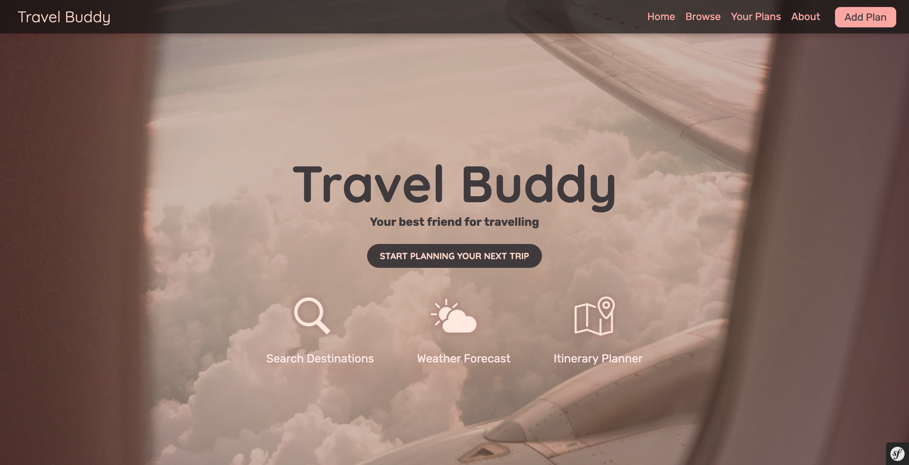
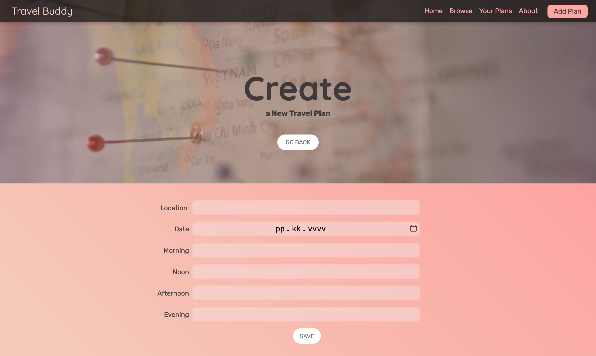
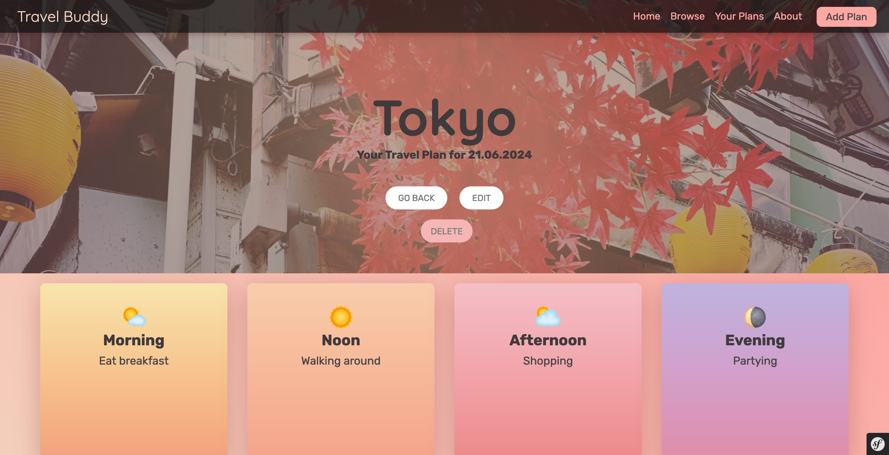

# Travel Buddy

This is a symfony web app for making travel plans for different locations. The app was originally done as a group project for Business College Helsinki's full stack course. The app uses pictures from [Unsplash](https://unsplash.com/) and icons from [icons8](https://icons8.com/).

The app uses symfony CRUD and postgresql to make a database of the travel plans.

You can use a form to add plans to the database.

You can also display, edit and delete plans.
